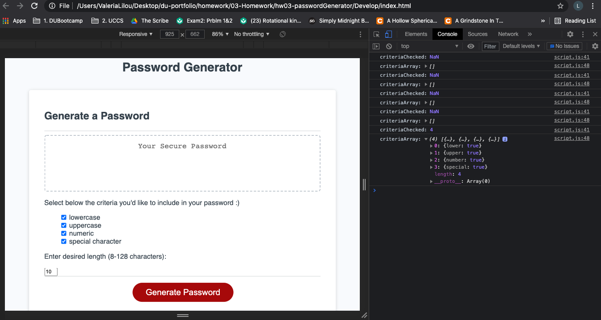

# hw03-passwordGenerator

The password generator is a significant tool, that assists in creating a strong password to protect private accounts and sensitive data. It solves time for the user when having to come up with a password that is secure enough. A password generator reassures the user by providing a random and greater secure password, than that of ones own making in better time. 

## My Task
For this project I was assigned to add the functionality of the password generator. Since, starter code had already been provided for the HTML and CSS files, my responsibility layed on develping a Javascript file for the application.

### Accomplishments:

To start off, I turned each criteria into a constant. Then, I was able to add an event listener to the 'generate button'. From there I skipped to the bottom and started to create functions for each of the asked criteria, and was introduced to the method of using the chart 'CharCode' for gathering letters, symbols and numbers. 

Now, I needed to start the function for generating a random password. First, the application needed to know how many and which of the criteria was checked by the user. Next, I moved onto building an array to give a random functionality to each criteria, and if no criteria was checked, the application would provide no password. (script.js; Lines 38-52)

Lastly, I provided a for-loop in order to create the random password, for the criteria selected by the user. (script.js; Lines 55-61) Along with, then calling for the password to be generated and returned. (script.js; Lines 62-63)

### Future Goal:
Overall, a challenge I had was wiht the meat of the project, and that was the random password displaying in the container labeled 'Your secure password'. 

I would like to return to this previous challenge and solve how to display the password within the container. So that the user may actually be able to retrieve and use the random password given by the application.

## Password Generator & Console

## Links
https://github.com/librarylilou/hw03-passwordGenerator

https://librarylilou.github.io/hw03-passwordGenerator/